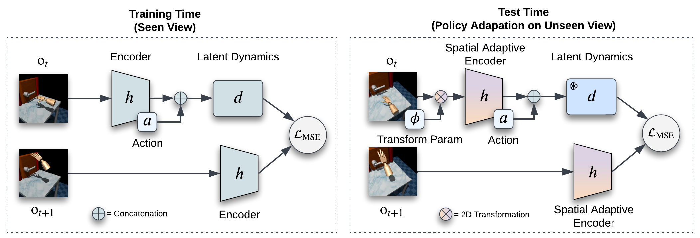

# MoVie: Visual Model-Based Policy Adaptation for View Generalization
Original PyTorch implementation of **MoVie** from

[MoVie: Visual Model-Based Policy Adaptation for View Generalization](https://yangsizhe.github.io/MoVie/) by

[Sizhe Yang](https://yangsizhe.github.io/)\*,   [Yanjie Ze](https://yanjieze.com/)\*,   [Huazhe Xu](http://hxu.rocks/)

<p align="center">
  <br><br>
</p>

## Method
MoVie is an effective approach to enable successful adaptation of visual model-based policies for view generalization during test time, without any need for reward signals and any modification during training time.

## Instructions
Assuming that you already have [MuJoCo](http://www.mujoco.org) installed, install dependencies using `conda`:

```
conda env create -f environment.yaml
conda activate movie
```

Install Adroit:

add `src/algorithms/modem/modem/tasks/mj_envs` to your `PYTHONPATH ` 

Install xArm:

```
cd src/envs/xarm_env
pip install -e. 
cd ../../..
```

Install wrappers for view generalization:

```
cd src/envs/distracting_control_viewgen
pip install -e. 
cd ../../..
```


To train the policies, you can refer to [TD-MPC](https://github.com/nicklashansen/tdmpc) and [MoDem](https://github.com/facebookresearch/modem). You will need to configure `wandb` and your `demonstration`/`logging` directories in `cfg/config.yaml` for MoDem, and configure `wandb` in `cfgs/default.yaml` for TD-MPC. Then run the training scripts:

```
# For TD-MPC
cd src/algorithms/tdmpc
bash train.sh

# For MoDem
cd src/algorithms/modem
bash train.sh
```

We also provide trained policies for all 18 tasks of our test platform in `checkpoints`.

To adapt the visual model-based policies for view generalization during test time, you will need to configure `wandb` in `cfg/config_adaptation.yaml` for MoDem policies and in `cfgs/default_adaptation.yaml` for TD-MPC policies. Then run the scripts:

```
# For TD-MPC
cd src/algorithms/tdmpc
bash eval.sh

# For MoDem
cd src/algorithms/modem
bash eval.sh
```

## License & Acknowledgements
MoVie is licensed under the MIT license. MuJoCo is licensed under the Apache 2.0 license. 

We utilize the official implementation of [TD-MPC](https://github.com/nicklashansen/tdmpc) and [MoDem](https://github.com/facebookresearch/modem) as the model-based reinforcement learning codebase. And the xArm environment is taken from [here](https://github.com/jangirrishabh/look-closer). We thank the authors for their implementation.

